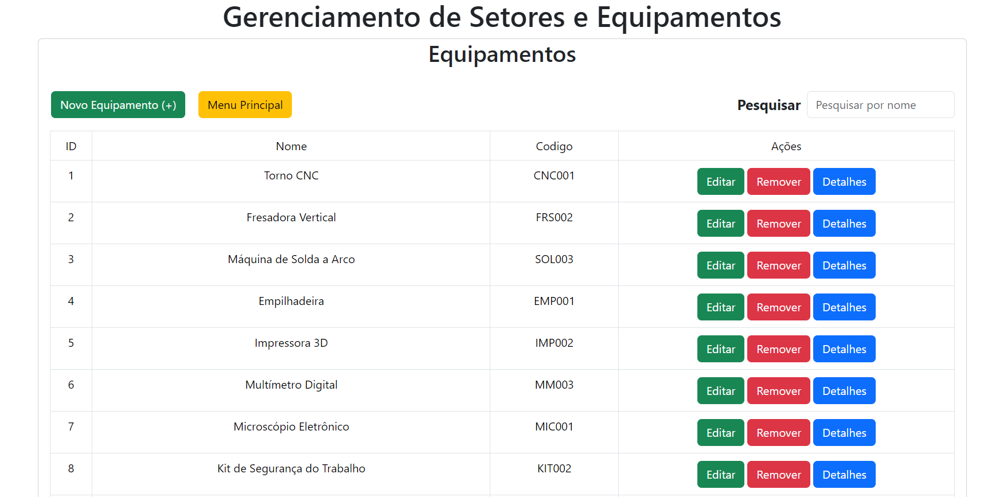
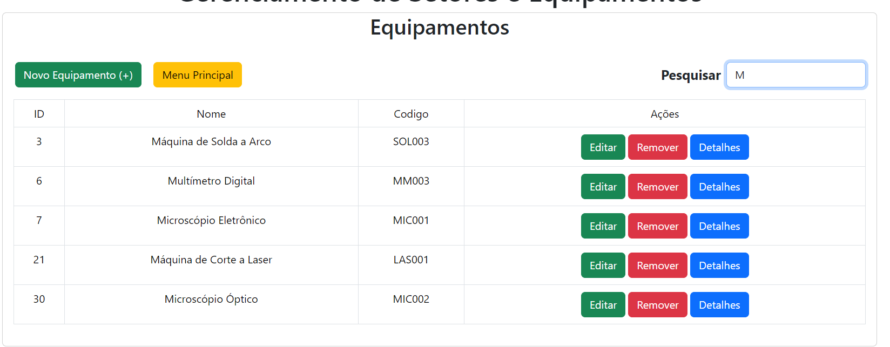
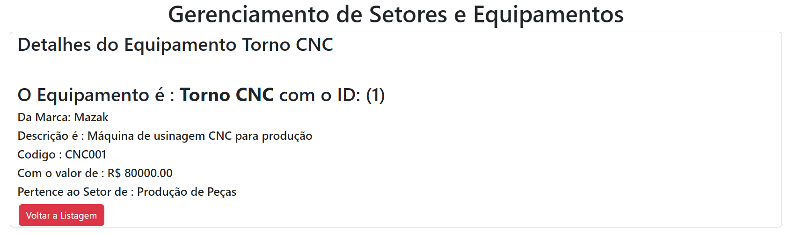

# Projeto Fullstack para controle de Equipamentos e Setores

Este projeto Fullstack tem como objetivo criar uma aplicação para o controle de equipamentos e setores em uma empresa. A aplicação permitirá o cadastro, atualização, remoção e visualização de informações relacionadas aos equipamentos utilizados pela empresa. Podendo na busca obter todos os equipamentos, ou apenas aqueles correspondentes a busca.

# Tecnologias Utilizadas

### FRONTEND

Tecnologias Utilizadas no Frontend:
No frontend, foi utilizado React para a criação de componentes e gerenciamento de estado. Além disso, foi utilizado Bootstrap para a estilização e facilitar o desenvolvimento.

### BACKEND

Node.js: Ambiente de execução JavaScript do lado do servidor.
Express.js: Framework para construção de aplicativos web em Node.js.
PostgreSQL: Banco de dados relacional para armazenamento persistente dos dados.

### Formulários:

Utilize os formulários disponíveis na interface para inserir e atualizar dados.
Preencha os campos obrigatórios e envie o formulário para cadastrar ou atualizar um equipamento.

Lembre-se de que para as requisições diretas (como via Insomnia, Postman ou Curl), é necessário estar ciente dos endpoints disponíveis na API e dos parâmetros necessários para cada operação.

## Rotas da API

#### Retorna todos os Equipamentos

```http
  GET /equipamentos
```

#### Retorna um item

```http
  GET /equipamentos/${id}
```

| Parâmetro | Tipo  | Descrição             |
| :-------- | :---- | :-------------------- |
| `id`      | `int` | **Obrigatório**. O ID |

```http
  PUT /equipamentos/${id}
```

| Parâmetro | Tipo  | Descrição             |
| :-------- | :---- | :-------------------- |
| `id`      | `int` | **Obrigatório**. O ID |

```http
  DELETE /equipamentos/${id}
```

| Parâmetro | Tipo  | Descrição             |
| :-------- | :---- | :-------------------- |
| `id`      | `int` | **Obrigatório**. O ID |

```http
  GET /equipamentos?nome=${nome}
```

| Parâmetro | Tipo |
| `nome` | `string` |

#### Retorna todos os Setores

```http
  GET /setores
```

#### Retorna um item

```http
  GET /setores/${id}
```

| Parâmetro | Tipo  | Descrição             |
| :-------- | :---- | :-------------------- |
| `id`      | `int` | **Obrigatório**. O ID |

```http
  PUT /setores/${id}
```

| Parâmetro | Tipo  | Descrição             |
| :-------- | :---- | :-------------------- |
| `id`      | `int` | **Obrigatório**. O ID |

```http
  DELETE /setores/${id}
```

| Parâmetro | Tipo  | Descrição             |
| :-------- | :---- | :-------------------- |
| `id`      | `int` | **Obrigatório**. O ID |

```http
  GET /setores?nome=${nome}
```

| Parâmetro | Tipo     |
| :-------- | :------- |
| `nome`    | `string` |

## Formulários

# TELA SETOR


# TELAS EQUIPAMENTOS






